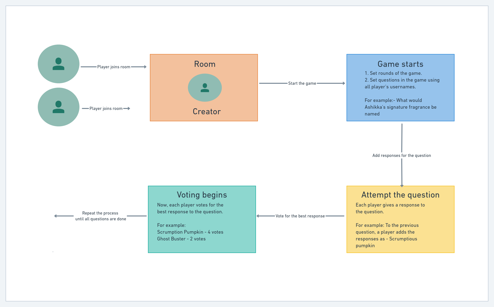

!-- TABLE OF CONTENTS -->

## Table of Contents

- [About the Project](#about-the-project)
  - [Built With](#built-with)
- [Getting Started](#getting-started)
  - [Prerequisites](#prerequisites)
  - [Installation](#installation)
- [Usage](#usage)

<!-- ABOUT THE PROJECT -->

## About The Project



We’re sure you’ve played _PSYCH!_, a fun guessing game by Ellen DeGeneres, where trivia meets Cards Against Humanity. Then you must also be aware of how the game recently has become increasingly monetized making it a bit difficult to play it your friends.

We have developed a website to get your needs covered with this website version of _PSYCH!_. Choose from a variety of fun and hilarious categories, such as “The Truth Comes Out,” in which you and your friends become the game! Get ready to answer funny and ridiculous questions about one another.

**Sike!** is the perfect free website for family or friends game night, Zoom calls, road trips, or even waiting in line! Grab your devices, gather ‘round, and get ready for a gaming experience unlike any other house party game you’ve ever played!

### Built With

- [express](https://www.npmjs.com/package/express)
- [nodemon](https://www.npmjs.com/package/nodemon)
- [joi](https://www.npmjs.com/package/nodemon)
- [uuid](https://www.npmjs.com/package/uuid)
- [mongoose](https://www.npmjs.com/package/mongoose)
- [socket.io](https://www.npmjs.com/package/socket.io)
- [winston](https://www.npmjs.com/package/winston)

<!-- GETTING STARTED -->

## Getting Started

To get a local copy up and running follow these simple steps.

### Prerequisites

This is an example of how to list things you need to use the software and how to install them.

- npm

```sh
npm install npm@latest -g
```

- Typescript

```sh
npm install -g typescript
```

### Installation

1. Clone the repo

```sh
git clone https://github.com/heinryanselm/Sike.git
```

2. Install NPM packages

```sh
npm install
```

3. Add necessary environment variables to `.env` file.

```sh
{
        echo 'PORT='
        echo 'DB_URL='
} >> .env
```

<!-- USAGE EXAMPLES -->

## Usage

### 1. Create room

```http
POST /room/join
```

| Parameter |   Type   | Description |
| :-------: | :------: | :---------: |
|  `body`   | `string` |  username   |
|  `body`   | `number` |   rounds    |

### Response format

```json
{
  "success": true,
  "message": "Game created successfully",
  "data": {
    "rounds": 1,
    "roomId": "someRandomUUID",
    "creator": "creatorName"
  }
}
```

### 2. Join a created room

```http
POST /room/join/:roomId
```

| Parameter |   Type   | Description |
| :-------: | :------: | :---------: |
|  `body`   | `string` |  username   |

### Response Format

```json
{
  "success": true,
  "message": "Room joined successfully",
  "data": {
    "players": 4,
    "roomId": "someRandomUUID"
  }
}
```

<!-- LICENSE -->

## License

Distributed under the MIT License. See [`LICENSE`](./LICENSE) for more information.
